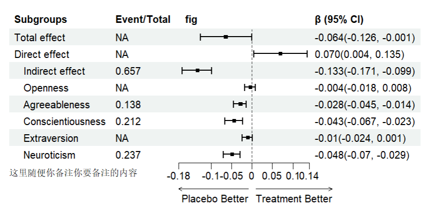

# 1024绘制森林图

```R
library(tidyverse)
library(grid)
library(forestploter)
dt <- read.csv("subgroup.csv")
dt$Subgroups <- ifelse(
  is.na(dt$blank),  # 检查 Subgroups 是否为空或 NA
  dt$Subgroups,  # 如果为空，保持不变
  ifelse(
    dt$blank == 2, paste("  ", dt$Subgroups),  # 如果 blank == 2，添加两个空格
    ifelse(
      dt$blank == 4, paste("    ", dt$Subgroups),  # 如果 blank == 4，添加四个空格
      dt$Subgroups  # 其他情况不动
      )
    )
  )
str(dt)
dt$se <- (dt$high - dt$low)/1.96 #生成一个变量se，绘图时表示正方形的大小
dt$flag <- paste(rep(" ", 20), collapse = " ") #生成一个绘图区间
      
p<-forest(dt[,c(1:6)],
          est = dt$est, #效应值
          lower = dt$low, #下限值
          upper = dt$high,  #上限值
          #sizes = dt$se,  #点点的大小
          ci_column = 3,  #在第3列画森林图
          ref_line = 1,#竖直线的位置
          arrow_lab = c("Placebo Better", "Treatment Better"),
          xlim = c(0.95,1.05),#刻度区间
          #footnote = "这里随便你备注你要备注的内容",
          ticks_at = c(0.95,1,1.05),#刻度点分别位
          theme=tm)

edit_plot(p,
          row = c(1,4,7,12,15,18,21,24,27,30,33,36,39),
          gp = gpar(col = "black", fontface = "bold"))#特定行加粗加色
p
tm <- forest_theme(base_size = 10,  #文本的大小
                   #设置可信区间外观
                   align = c("c", "l", "c", "c"),  # 这里控制对齐方式，第四列为 'c' 表示居中
                   ci_pch = 15, #可信区间点的形状
                   ci_col = "blue4",  #CI的颜色
                   ci_fill = "red3", #CI颜色填充
                   ci_alpha = 1, #CI透明度
                   ci_lty = 1,  #CI的线型
                   ci_lwd = 1.5,  #CI的线宽
                   ci_Theight = 0.4, #CI的高度，默认是NULL
                   # 设置中间的竖的线外观
                   refline_lwd = 1, #中间的竖的虚线
                   refline_lty = "dashed",
                   refline_col = "grey20",
                   # 垂直线宽/类型/颜色
                   vertline_lwd = 1, #可以添加一条额外的垂直线，如果没有就不显示
                   vertline_lty = "dashed",
                   vertline_col = "grey20",
                   # 更改填充和边框的摘要颜色
                   summary_fill = "goldenrod1",  #汇总部分大菱形的颜色
                   summary_col = "#4575b4",
                   # 设置脚注字体大小/字体/颜色
                   footnote_cex = 1,
                   footnote_fontface = "italic",
                   footnote_col = "red")
save_plot_as_pdf("forestmap.pdf")

```

数据示例

结果展示


参考文献：[forestploter包，超赞的森林图绘制新R包-CSDN博客](https://blog.csdn.net/qazplm12_3/article/details/125139420)

[7. R语言可视化—基于forestplot包、forestploter包绘制森林图](https://mp.weixin.qq.com/s/3Nn9i4jXVPCkmgOLQZyQDw)

(PS: markdown语法学习：[markdown语法(1) | Syntax of markedown(1) - 知乎](https://zhuanlan.zhihu.com/p/683069416))

