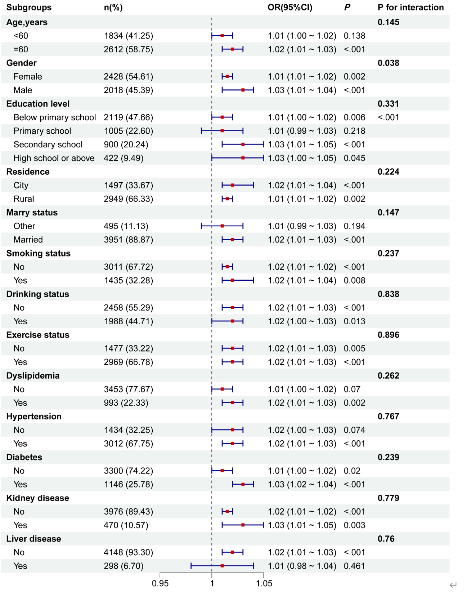

# 1024绘制森林图

```R
###绘制森林图####
library(tidyverse)
library(grid)
library(forestploter)
library(dplyr)
library(readxl)
dt <- read_excel("subgroup1.xlsx")

dt <- dt %>%
  mutate(Subgroups = case_when(
    is.na(blank) ~ Subgroups,  # 如果 blank 为 NA，保持 Subgroups 不变
    blank == 2 ~ paste("  ", Subgroups),  # 如果 blank == 2，添加两个空格
    blank == 4 ~ paste("    ", Subgroups),  # 如果 blank == 4，添加四个空格
    TRUE ~ Subgroups  # 其他情况保持不变
  ))


dt$se <- (dt$high - dt$low)/1.96 #生成一个变量se，绘图时表示正方形的大小
dt$fig <- paste(rep(" ", 20), collapse = " ") #生成一个绘图区间

tm <- forest_theme(base_size = 10,  #文本的大小
                   #设置可信区间外观
                   align = c("c", "l", "c", "c"),  # 这里控制对齐方式，第四列为 'c' 表示居中
                   ci_pch = 15, #可信区间点的形状0-18
                   ci_col = "black",  #CI的颜色
                   ci_fill = "black", #CI颜色填充
                   ci_alpha = 1, #CI透明度
                   ci_lty = 1,  #CI的线型
                   ci_lwd = 1.5,  #CI的线宽
                   ci_Theight = 0.4, #CI的高度，默认是NULL
                   # 设置中间的竖线宽/类型/颜色
                   refline_gp = gpar(lwd = 1, lty = "dashed", col = "grey20"),
                   # 垂直线宽/类型/颜色
                   vertline_lwd = 1, #可以添加一条额外的垂直线，如果没有就不显示
                   vertline_lty = "dashed",
                   vertline_col = "black",
                   # 更改填充和边框的摘要颜色
                   summary_fill = "goldenrod1",  #汇总部分大菱形的颜色
                   summary_col = "#4575b4",
                   # 设置脚注字体大小/字体/样式/颜色
                   footnote_gp = gpar(fontsize = 10, fontfamily = "italic", fontface
                                      = "plain", col = "black")
                   )
p<-forest(dt[,c(1:4)],
            est = dt$est, #效应值
            lower = dt$low, #下限值
            upper = dt$high,  #上限值
            #sizes = dt$se,  #点点的大小
            ci_column = 3,  #在第4列画森林图
            ref_line = 0,#竖直线的位置
            arrow_lab = c("Placebo Better", "Treatment Better"),
            xlim = c(-0.18,0.14),#刻度区间
          ticks_at = c(-0.18,-0.1,-0.05,0,0.05,0.1,0.14),#刻度点分别位于
            footnote = "这里随便你备注你要备注的内容",
            theme=tm)
p
edit_plot(p,
          row = c(1,2),
          gp = gpar(col = "red", fontface = "bold"))#特定行加粗加色
```

数据示例

结果展示


参考文献：[forestploter包，超赞的森林图绘制新R包-CSDN博客](https://blog.csdn.net/qazplm12_3/article/details/125139420)

[7. R语言可视化—基于forestplot包、forestploter包绘制森林图](https://mp.weixin.qq.com/s/3Nn9i4jXVPCkmgOLQZyQDw)

(PS: markdown语法学习：[markdown语法(1) | Syntax of markedown(1) - 知乎](https://zhuanlan.zhihu.com/p/683069416))

